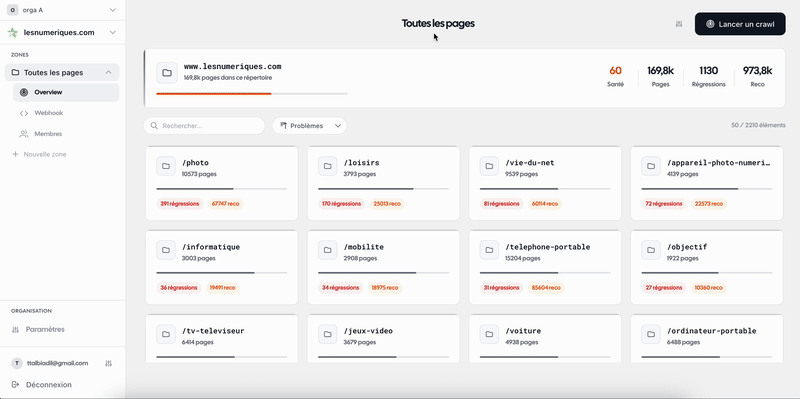

<h1 align="center">Seogard.io</h1>

  Open-source SEO & GEO monitoring — catches regressions before Google does.

  
  
  

  

---

A deploy breaks your meta tags on 200 pages. Nobody notices for 3 weeks. Traffic drops 15%.

SEOGARD monitors every page, every day. SSR and CSR. Alerts you in real-time when something breaks.

## Features

- **SSR + CSR comparison** — the only tool that compares server-rendered HTML vs JavaScript-rendered output on every page
- **Real-time alerts** — email, Slack, Teams, Jira when a regression is detected
- **Hundreds of SEO & GEO rules** — meta tags, canonical, noindex, redirects, structured data, headings, content, AI readiness (llms.txt, robots.txt AI crawlers)
- **CI/CD webhook** — block deploys that break SEO
- **Multi-site, multi-zone** — monitor different sections of your site with different rules
- **Self-hosted or Cloud** — your infra or ours

## Self-Hosted

Deploy on your own infrastructure in minutes: [seogard.io/docs/self-hosted](https://seogard.io/docs/self-hosted)

## Cloud

Zero setup, zero maintenance. [seogard.io](https://seogard.io)

- Free trial, no credit card required
- 0,007 EUR/mois/page
- On-premise available on request

## Tech Stack

| Component | Tech |
|-----------|------|
| Frontend + API | Nuxt 4 (SSR) + Nitro |
| Crawler | Playwright (headless Chromium) |
| Database | MongoDB |
| Queue | Redis |
| Containers | Docker Compose |

## Contributing

See [CONTRIBUTING.md](./CONTRIBUTING.md)

## Security

See [SECURITY.md](./SECURITY.md)

## License

[Business Source License 1.1](./LICENCE) — free to self-host, source available. Change license to Apache 2.0 on 2029-04-02.
